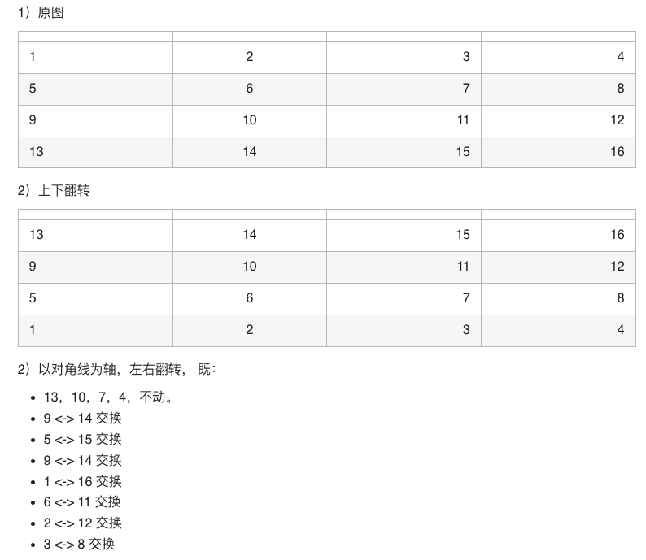
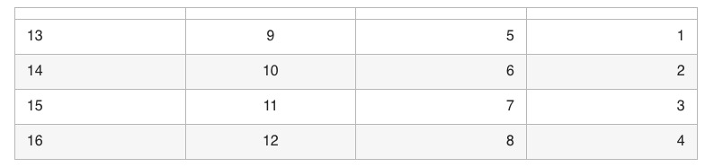

# 48. Rotate Image

You are given an n x n 2D matrix representing an image, rotate the image by 90 degrees (clockwise).

You have to rotate the image in-place, which means you have to modify the input 2D matrix directly. DO NOT allocate another 2D matrix and do the rotation.

### Example 1:


```
Input: matrix = [[1,2,3],[4,5,6],[7,8,9]]
Output: [[7,4,1],[8,5,2],[9,6,3]]
```

### Example 2:


```
Input: matrix = [[5,1,9,11],[2,4,8,10],[13,3,6,7],[15,14,12,16]]
Output: [[15,13,2,5],[14,3,4,1],[12,6,8,9],[16,7,10,11]]
```


### Constraints:

* n == matrix.length == matrix[i].length
* 1 <= n <= 20
* -1000 <= matrix[i][j] <= 1000

### Translate:

> 48. 旋转图像
> 
> 给定一个 n×n 的二维矩阵matrix 表示一个图像。请你将图像顺时针旋转 90 度。
>
> 你必须在 原地 旋转图像，这意味着你需要直接修改输入的二维矩阵。请不要 使用另一个矩阵来旋转图像。


### 解题思路
要想实现旋转90°，需要两步实现

1）原图
|||||
|-|:-:|-:|-:|
|1|2|3|4|
|5|6|7|8|
|9|10|11|12|
|13|14|15|16|

2）上下翻转

|||||
|-|:-:|-:|-:|
|13|14|15|16|
|9|10|11|12|
|5|6|7|8|
|1|2|3|4|

2）以对角线为轴，左右翻转， 既：
* 13，10，7，4，不动。
* 9 <-> 14 交换
* 5 <-> 15 交换
* 9 <-> 14 交换
* 1 <-> 16 交换
* 6 <-> 11 交换
* 2 <-> 12 交换
* 3 <-> 8 交换

|||||
|-|:-:|-:|-:|
|13|9|5|1|
|14|10|6|2|
|15|11|7|3|
|16|12|8|4|




### 代码

```golang
func rotate(matrix [][]int) {
	top, down := 0, len(matrix) - 1
	for top < down {
		matrix[top], matrix[down] = matrix[down], matrix[top]
		top++
		down--
	}
	for i := 0; i < len(matrix); i++ {
		for j := i + 1; j < len(matrix); j++ {
			matrix[i][j], matrix[j][i] = matrix[j][i], matrix[i][j]
		}
	}
}
```