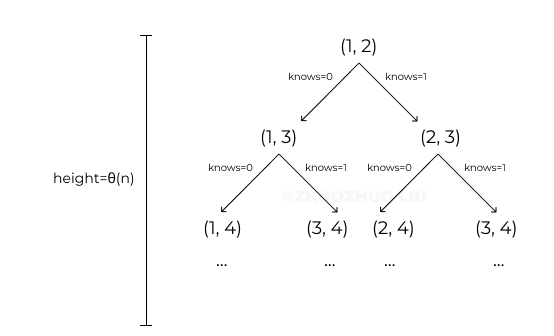

# 277. Find the Celebrity

### Problem
Suppose you are at a party with n people (labeled from 0 to n — 1) and among them, there may exist one celebrity. The definition of a celebrity is that all the other n — 1 people know him/her but he/she does not know any of them.

Now you want to find out who the celebrity is or verify that there is not one. The only thing you are allowed to do is to ask questions like: “Hi, A. Do you know B?” to get information of whether A knows B. You need to find out the celebrity (or verify there is not one) by asking as few questions as possible (in the asymptotic sense).

You are given a helper function bool knows(a, b) which tells you whether A knows B. Implement a function int findCelebrity(n). There will be exactly one celebrity if he/she is in the party. Return the celebrity’s label if there is a celebrity in the party. If there is no celebrity, return -1.

### Idea 1: Brute Force
For each number i, we need to check if i is a celebrity or not. How to check? We check all knows(i, j) where j from 0 to n. Only when all pairs of knows(i, j) == 0 && all pairs of knows(j, i) ==1, we know i is a celebrity. Otherwise, i is not a celebrity.

T(n) = O(n²), since we need to check n numbers, and for each number we need to pair it with n-1 numbers to check. Another way to think about it is to check all n² pairs of knows(i, j).

### Idea 2: Linear Elimination
Do we need to check all pairs of knows(i, j)? We don’t.

If i knows j, that means i is not the celebrity because a celebrity doesn’t know anyone.

If i doesn’t know j, that means j is not the celebrity because everyone knows the celebrity.

If you understand the above, you know two secrets of knows(i, j):

* Secret 1. If knows(i, j) = 1, i is not the celebrity.
* Secret 2. If knows(i, j) = 0, j is not the celebrity.
We will, and only will, get two results: 0 or 1 after calling `knows`. So with each call to `knows(i, j)`, we can eliminate a non-celebrity from n.

Based on the above analysis, we design the algorithm below:

Base case: i = 0, j = 1. We check knows(0, 1) and determine a potential candidate.

* If knows(0, 1) = 1, j is the potential candidate.
* If knows(0, 1) = 0, i is the potential candidate.

2. After determining a candidate between 0 and 1, we need to compare the winning candidate with a 3rd number. Therefore, we need a for loop to always go to the next number so that the candidate can compare to.

For loop where j traverses all numbers:

* If knows(candidate, j) == 1 we eliminate the current candidate and set `candidate = j`.
* If knows(candidate, j) == 0 we eliminate j=1 and keep the current candidate.

After running up all numbers, we will get a final candidate X. Also we know that, if a celebrity exists, it must be X.

Here is a tree that demonstrates all possible paths. At each level we will add a new number to compare with, so the height/time cost is theta(n).



Are we done? No. This final candidate X is just our best guess! Remember to check if X is the real celebrity!

Why? Because we only compared the final candidate X once, we don’t know the relationship between X and other numbers. Since there can be no celebrity, maybe X is not. We trust X just because other numbers are definitely not!

So, we need one more step to check X:

3. Check if knows(final candidate, k) == 0 && knows(k, final candidate) == 1. If true, it is the real celebrity that we are looking for.

### Translate:

> 277. 搜寻名人

假设你是一个专业的狗仔，参加了一个 n 人派对，其中每个人被从 0 到 n - 1 标号。在这个派对人群当中可能存在一位 “名人”。所谓 “名人” 的定义是：其他所有 n - 1 个人都认识他/她，而他/她并不认识其他任何人。

现在你想要确认这个 “名人” 是谁，或者确定这里没有 “名人”。而你唯一能做的就是问诸如 “A 你好呀，请问你认不认识 B呀？” 的问题，以确定 A 是否认识 B。你需要在（渐近意义上）尽可能少的问题内来确定这位 “名人” 是谁（或者确定这里没有 “名人”）。

在本题中，你可以使用辅助函数 bool knows(a, b) 获取到 A 是否认识 B。请你来实现一个函数 int findCelebrity(n)。

派对最多只会有一个 “名人” 参加。若 “名人” 存在，请返回他/她的编号；若 “名人” 不存在，请返回 -1。

### 示例 1:

```
输入: graph = [
[1,1,0],
[0,1,0],
[1,1,1]
]
输出: 1
解释: 有编号分别为 0、1 和 2 的三个人。graph[i][j] = 1 代表编号为 i 的人认识编号为 j 的人，而 graph[i][j] = 0 则代表编号为 i 的人不认识编号为 j 的人。“名人” 是编号 1 的人，因为 0 和 2 均认识他/她，但 1 不认识任何人。
```
### 示例 2:

```
输入: graph = [
[1,0,1],
[1,1,0],
[0,1,1]
]
输出: -1
解释: 没有 “名人”
```

提示：

* n == graph.length
* n == graph[i].length
* 2 <= n <= 100
* graph[i][j] 是 0 或 1.
* graph[i][i] == 1

### 进阶：

如果允许调用 API knows 的最大次数为 3 * n ，你可以设计一个不超过最大调用次数的解决方案吗？


### 解题思路
Time: O(n); Space: O(1)
1. 先找出可能是`名人`的人 A，他不认识其他人；如果A是名人，还需要，所有人认识他
2. 如果这个人 A 认识其他人，或者其他人有人不认识这个人 A return -1
3. 如果 2 没有返回 -1 则说明，当前A就是这个名人
### 代码

```golang
func solution(knows func(a int, b int) bool) func(n int) int {
	return func(n int) int {
		celebrity := 0
		for i := 1; i < n; i++ {
			if knows(celebrity, i) {
                //当前celebrity，不是名人
				celebrity = i
			}
		}
		for i := 0; i < n; i++ {
			if i == celebrity {
				continue
			}
			if knows(celebrity, i) || !knows(i, celebrity) {
				return -1
			}
		}
		return celebrity
	}
}
```