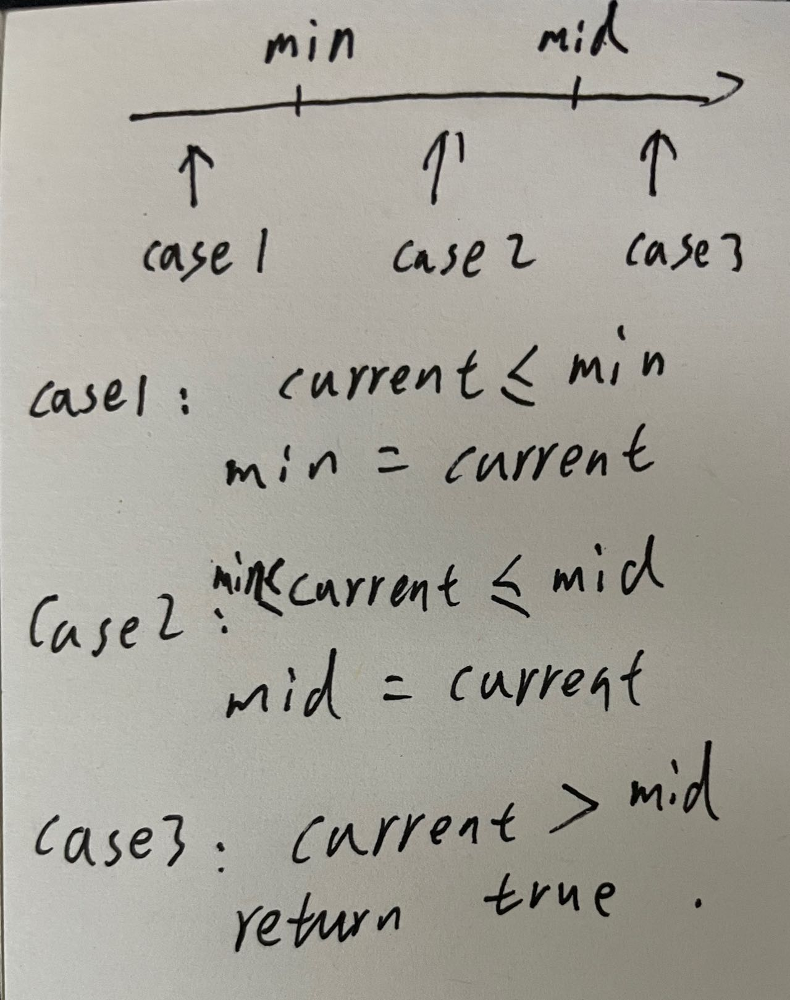

# 334. Increasing Triplet Subsequence

Given an integer array nums, return true if there exists a triple of indices (i, j, k) such that i < j < k and nums[i] < nums[j] < nums[k]. If no such indices exists, return false.

### Example 1:

```
Input: nums = [1,2,3,4,5]
Output: true
Explanation: Any triplet where i < j < k is valid.
```

### Example 2:

```
Input: nums = [5,4,3,2,1]
Output: false
Explanation: No triplet exists.
```

### Example 3:

```
Input: nums = [2,1,5,0,4,6]
Output: true
Explanation: The triplet (3, 4, 5) is valid because nums[3] == 0 < nums[4] == 4 < nums[5] == 6.
```

### Constraints:

* 1 <= nums.length <= 5 * 105
* -231 <= nums[i] <= 231 - 1

### Follow up

Could you implement a solution that runs in O(n) time complexity and O(1) space complexity?

### Translate:

> 334. 递增的三元子序列

给你一个整数数组nums ，判断这个数组中是否存在长度为 3 的递增子序列。

如果存在这样的三元组下标 (i, j, k)且满足 i < j < k ，使得nums[i] < nums[j] < nums[k] ，返回 true ；否则，返回 false 。

示例 1：

输入：nums = [1,2,3,4,5]
输出：true
解释：任何 i < j < k 的三元组都满足题意

示例 2：

输入：nums = [5,4,3,2,1]
输出：false
解释：不存在满足题意的三元组

示例 3：

输入：nums = [2,1,5,0,4,6]
输出：true
解释：三元组 (3, 4, 5) 满足题意，因为 nums[3] == 0 < nums[4] == 4 < nums[5] == 6

提示：

1 <= nums.length <= 5 * 105
-231 <= nums[i] <= 231 - 1

进阶：你能实现时间复杂度为 O(n) ，空间复杂度为 O(1) 的解决方案吗？


### 解题思路



### 代码

```golang
func increasingTriplet(nums []int) bool {
	min, mid := math.MaxInt32, math.MaxInt32
	for _, current := range nums {
		if current <= min {
			//case 1
			min = current
		} else if current <= mid {
			//case 2
			mid = current
		} else if current > mid {
			//case 3
			return true
		}
	}
	return false
}
```