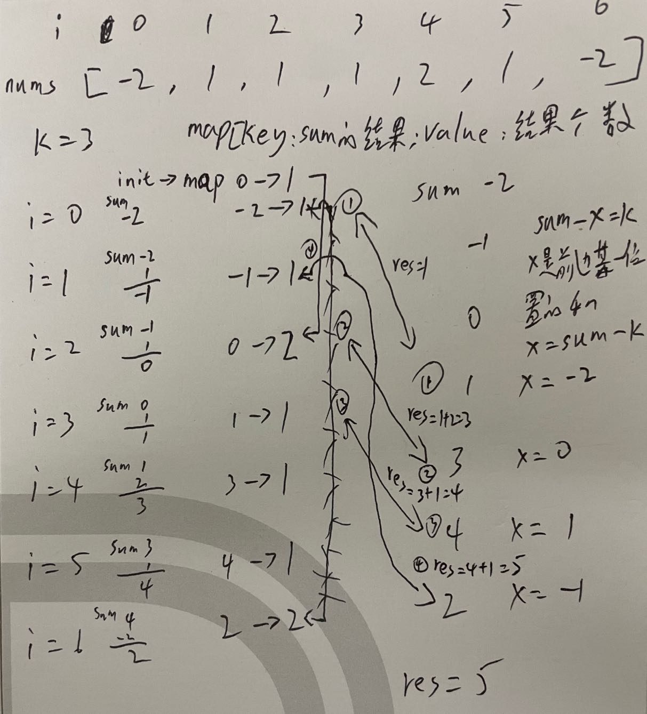

# 560. Subarray Sum Equals K

Given an array of integers nums and an integer k, return the total number of subarrays whose sum equals to k.

A subarray is a contiguous non-empty sequence of elements within an array.

### Example 1:

```
Input: nums = [1,1,1], k = 2
Output: 2
```

### Example 2:

```
Input: nums = [1,2,3], k = 3
Output: 2
```

### Constraints:

* 1 <= nums.length <= 2 * 10^4
* -1000 <= nums[i] <= 1000
* -10^7 <= k <= 10^7

### Translate:

> 560. 和为 K 的子数组

给你一个整数数组 nums 和一个整数 k ，请你统计并返回 该数组中和为 k 的连续子数组的个数 。


### 示例 1：

```
输入：nums = [1,1,1], k = 2
输出：2
```

### 示例 2：

```
输入：nums = [1,2,3], k = 3
输出：2
```

### 提示：

* 1 <= nums.length <= 2 * 104
* -1000 <= nums[i] <= 1000
* -107 <= k <= 107

